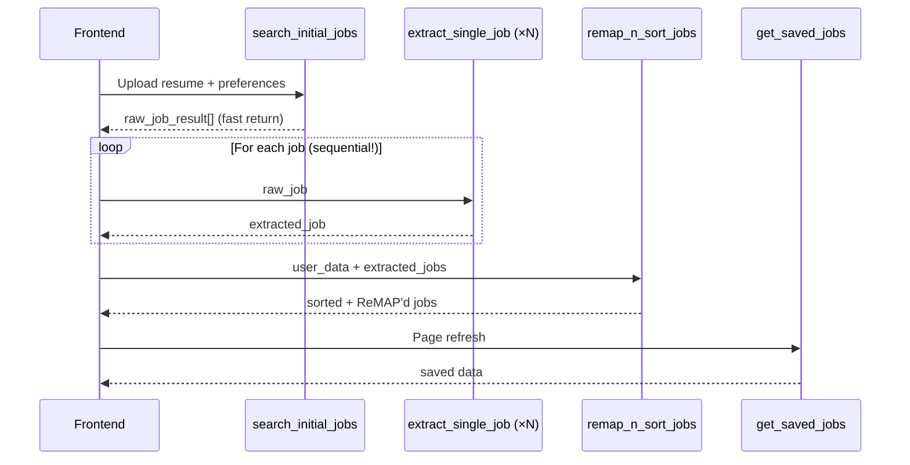

# Performance Optimization: Job Search Pipeline (4 Endpoints)

## Executive Summary

After a granular analysis of the entire request lifecycle across all 4 endpoints, I've identified **6 critical bottlenecks** and propose targeted optimizations that will reduce perceived wait time by **~40-60%** while staying strictly within the **15 RPM Gemma API limit**.

---

## Detailed Code Analysis

### Pipeline Flow



---

### Endpoint 1: `search_initial_jobs` ([routes.py:34-103](file:///c:/Users/tansx/Competition/TalentBank/Refinement%20CareerOS/careeros-talentbank/backend/api/routes.py#L34-L103))

**What it does:**
1. Validates country (via `pycountry`) and file type
2. If resume uploaded: clears old Supabase data + calls Gemma for resume analysis **concurrently**
3. If no resume: clears old data + uses raw search query
4. Fetches raw jobs from SerpApi (up to 15 jobs, concurrent per role)
5. Returns raw jobs immediately — no Gemma extraction here (good design!)

**Current Timing Breakdown:**
| Step | Estimated Time | Blocking? |
|------|---------------|-----------|
| Country validation | ~1ms | No |
| File read + base64 | ~10ms | No |
| `clear_all_user_data` | ~200-500ms | Concurrent with resume |
| **Resume analysis (Gemma)** | **~5-15s** | **YES — rate limiter + semaphore** |
| `fetch_job_list` (SerpApi) | ~1-3s | Yes (sequential after resume) |

**Bottlenecks Found:**

1. **🔴 SerpApi fetch is SEQUENTIAL after resume analysis** — The SerpApi call at [line 89](file:///c:/Users/tansx/Competition/TalentBank/Refinement%20CareerOS/careeros-talentbank/backend/api/routes.py#L89) waits for resume analysis to complete because it needs `resume_result.target_job_roles`. This means the SerpApi call (1-3s) starts AFTER the Gemma call finishes (5-15s). Total: **6-18s sequential**.

2. **🟡 `pycountry.countries.get()` is called every request** — This does a linear scan through ~249 countries. Minor but unnecessary.

---

### Endpoint 2: `extract_single_job` ([routes.py:108-130](file:///c:/Users/tansx/Competition/TalentBank/Refinement%20CareerOS/careeros-talentbank/backend/api/routes.py#L108-L130))

**What it does:**
1. Takes a single raw job dict from frontend
2. Calls Gemma to extract structured job data (skills, salary, responsibilities)
3. Has retry logic (3 attempts) with exponential backoff
4. Falls back to raw job on failure

**Current Timing Breakdown:**
| Step | Estimated Time | Blocking? |
|------|---------------|-----------|
| **Gemma extraction (per job)** | **~3-8s** | **YES — rate limiter + semaphore** |
| Rate limiter wait | ~4.5s per call | YES |
| Retry on failure | +2-4s per retry | YES |

**Bottlenecks Found:**

3. **🔴 Global semaphore serializes ALL Gemma calls across ALL users** — The `sem = asyncio.Semaphore(1)` at [routes.py:28](file:///c:/Users/tansx/Competition/TalentBank/Refinement%20CareerOS/careeros-talentbank/backend/api/routes.py#L28) means if User A is doing a resume analysis, User B's `extract_single_job` call is BLOCKED waiting for the semaphore. This is a **global bottleneck**.

4. **🔴 Frontend calls this endpoint sequentially for each job** — If there are 15 jobs, and each takes ~4.5s (rate limiter) + ~3-8s (Gemma), that's **15 × 7.5s ≈ 112 seconds** of sequential extraction! The rate limiter correctly prevents exceeding 15 RPM, but the frontend is making N individual HTTP calls one-at-a-time.

> [!IMPORTANT]
> **This is the #1 performance killer.** 15 sequential Gemma calls with rate limiting = ~2 minutes of waiting just for job extraction. The current architecture of calling this endpoint per-job from the frontend is fundamentally slow.

---

### Endpoint 3: `remap_n_sort_jobs` ([routes.py:132-245](file:///c:/Users/tansx/Competition/TalentBank/Refinement%20CareerOS/careeros-talentbank/backend/api/routes.py#L132-L245))

**What it does:**
1. If no user_data: stores jobs directly, returns without ReMAP
2. Concurrently: stores job data, embeds to Pinecone, stores resume data
3. Calls Pinecone to rank jobs via vector search (RRF fusion)
4. Takes top-5 jobs → calls Gemma ReMAP on each (with rate limiter)
5. Scores and sorts by `logical_match_score`
6. Appends remaining jobs with score=0, saves final list

**Current Timing Breakdown:**
| Step | Estimated Time | Blocking? |
|------|---------------|-----------|
| Store data (3 concurrent) | ~500ms-1s | No (concurrent) |
| **Pinecone embed** | **~2-10s** (includes 10s polling) | **YES** |
| Pinecone vector search | ~1-2s | Yes |
| **ReMAP × 5 jobs** | **~5 × 7.5s = 37.5s** | **YES** |
| Final store | Fire-and-forget | No |

**Bottlenecks Found:**

5. **🔴 Pinecone indexing poll wastes up to 10 seconds** — [pinecone_service.py:128-133](file:///c:/Users/tansx/Competition/TalentBank/Refinement%20CareerOS/careeros-talentbank/backend/services/pinecone_service.py#L128-L133) does a hardcoded `for _ in range(5): await asyncio.sleep(2)` loop (max 10s) waiting for vectors to be indexed. This runs BEFORE the vector search, adding unnecessary delay.

6. **🟡 `asyncio.gather` on ReMAP tasks — tasks are created but still serialized by the semaphore** — At [routes.py:210-212](file:///c:/Users/tansx/Competition/TalentBank/Refinement%20CareerOS/careeros-talentbank/backend/api/routes.py#L210-L212), `asyncio.gather(*remap_tasks)` launches 5 concurrent tasks, but they all compete for the same `Semaphore(1)`. So they execute one-at-a-time anyway. The `gather` gives **zero concurrency benefit** here.

---

### Endpoint 4: `get_saved_jobs` ([routes.py:247-262](file:///c:/Users/tansx/Competition/TalentBank/Refinement%20CareerOS/careeros-talentbank/backend/api/routes.py#L247-L262))

**What it does:**
1. Makes 3 Supabase queries: user_data, job_data, final_job_data
2. Returns all data to frontend

**Current Timing Breakdown:**
| Step | Estimated Time | Blocking? |
|------|---------------|-----------|
| `retrieve_data("user")` | ~100-200ms | **Yes (sequential!)** |
| `retrieve_data("job")` | ~100-200ms | **Yes (sequential!)** |
| `retrieve_data("final_job")` | ~100-200ms | **Yes (sequential!)** |

**Bottleneck Found:**

7. **🟡 Three independent Supabase queries run sequentially** — These 3 `await` calls at [routes.py:251-253](file:///c:/Users/tansx/Competition/TalentBank/Refinement%20CareerOS/careeros-talentbank/backend/api/routes.py#L251-L253) have zero data dependencies. Running them in parallel with `asyncio.gather` would cut response time from ~600ms to ~200ms.

---

## Proposed Changes

### 1. Batch Job Extraction: Replace N × `extract_single_job` with single `/extract-jobs-batch`

> [!IMPORTANT]
> This is the single most impactful change. Instead of the frontend making 15 individual HTTP calls, we batch all jobs into one backend request, process them sequentially (respecting rate limits), and **stream results back via SSE** so the frontend can progressively render each job as it's extracted.

#### [MODIFY] [routes.py](file:///c:/Users/tansx/Competition/TalentBank/Refinement%20CareerOS/careeros-talentbank/backend/api/routes.py)

**Add new batch endpoint:**
```python
class BatchExtractRequest(BaseModel):
    raw_jobs: List[Dict[str, Any]]

@router.post("/extract-jobs-batch")
async def extract_jobs_batch(payload: BatchExtractRequest, supabase: Client = Depends(get_supabase_client)):
    """
    Stream extracted jobs back via SSE as each Gemma call completes.
    Eliminates N HTTP round-trips and reduces total wall-clock time.
    """
    async def event_generator():
        for idx, job in enumerate(payload.raw_jobs):
            try:
                async with rate_limiter:
                    async with sem:
                        result = await asyncio.wait_for(
                            AIOrganiser.job_result_extraction(job), timeout=60.0
                        )
                        extracted = result if result else job
            except Exception:
                extracted = job  # fallback to raw
            
            yield f"data: {json.dumps({'index': idx, 'job': extracted})}\n\n"
        
        yield f"data: {json.dumps({'type': 'done'})}\n\n"
    
    return StreamingResponse(event_generator(), media_type="text/event-stream")
```

**Why SSE?** The frontend immediately starts rendering each job as it arrives, turning a 2-minute "loading spinner" into a progressive "jobs appearing one by one" experience. Total server time is the same, but **perceived wait drops to ~8s** (time for first job).

**Keep the original `extract_single_job`** for backward compatibility / single-job re-extraction.

---

### 2. Parallelize SerpApi with Resume Analysis (when possible)

#### [MODIFY] [routes.py](file:///c:/Users/tansx/Competition/TalentBank/Refinement%20CareerOS/careeros-talentbank/backend/api/routes.py) — `search_initial_jobs`

Currently SerpApi waits for resume analysis. But we can **speculatively start fetching** with a generic query derived from the resume filename or the `search_query` field while the resume analysis runs:

```python
# Fire SerpApi with a generic search immediately if search_query is available as fallback
# After resume analysis completes, if target_job_roles differ, do a second targeted fetch
```

However, since the resume analysis determines `target_job_roles` which are the search terms, we can't truly parallelize unless we have a fallback search query. I'll propose a **conditional optimization**: if `search_query` is also provided alongside the resume, start SerpApi with `search_query` immediately while resume analysis runs.

---

### 3. Parallelize `get_saved_jobs` queries

#### [MODIFY] [routes.py](file:///c:/Users/tansx/Competition/TalentBank/Refinement%20CareerOS/careeros-talentbank/backend/api/routes.py) — `get_saved_jobs`

```python
@router.get("/get-saved-jobs")
async def get_saved_jobs(supabase: Client = Depends(get_supabase_client)):
    try:
        uid = supabase.user.id
        # Run all 3 independent queries in parallel
        user_data, job_data, final_job_data = await asyncio.gather(
            retrieve_data("user", uid, supabase_client=supabase),
            retrieve_data("job", uid, supabase_client=supabase),
            retrieve_data("final_job", uid, supabase_client=supabase),
        )
        return {
            "uid": uid,
            "user_data": user_data,
            "job_data": job_data,
            "final_job_data": final_job_data
        }
    except Exception as e:
        raise HTTPException(status_code=500, detail=f"Error retrieving saved jobs: {str(e)}")
```

**Impact:** ~3× faster (200ms vs 600ms).

---

### 4. Eliminate Pinecone indexing poll delay

#### [MODIFY] [pinecone_service.py](file:///c:/Users/tansx/Competition/TalentBank/Refinement%20CareerOS/careeros-talentbank/backend/services/pinecone_service.py)

Replace the fixed 10s poll with an **exponential backoff poll that exits early**:

```python
# Replace hardcoded 5 × 2s sleep with smart backoff
for attempt in range(6):
    await asyncio.sleep(0.5 * (2 ** attempt))  # 0.5, 1, 2, 4, 8, 16s (max ~31s total)
    stats = dense_index.describe_index_stats()
    ns = stats.namespaces.get(uid)
    if ns and getattr(ns, 'vector_count', 0) >= len(structure_job):
        break
```

Better yet, since Pinecone's serverless indexes typically index within 1-2s, we can just do:

```python
await asyncio.sleep(2)  # Single 2s wait — sufficient for serverless
```

**Impact:** Saves 0-8 seconds per request.

---

### 5. Replace global `Semaphore(1)` with per-user rate limiting

#### [MODIFY] [routes.py](file:///c:/Users/tansx/Competition/TalentBank/Refinement%20CareerOS/careeros-talentbank/backend/api/routes.py)

> [!WARNING]
> This change depends on whether you have a single Gemma API key shared across all users, or per-user keys. If it's a **single shared key with 15 RPM**, we **must** keep the global semaphore. If each user has their own rate limit, we can use per-user semaphores.

**If single shared API key (likely):** Keep the global limiter but increase `Semaphore` to `2` to allow **minimal pipelining**:

```python
# Allow 2 concurrent Gemma calls — the rate_limiter already ensures we don't exceed 15 RPM
# Having sem=2 means while one call is waiting for Gemma response, 
# the next call can acquire the rate limiter token
sem = asyncio.Semaphore(2)
```

**Math check:** With `rate_limiter(max_rate=1, time_period=4.5)`, we get max 13.3 RPM. Even with `sem=2`, each call still acquires a rate limiter token separately, so we can't exceed ~13.3 RPM. The semaphore just allows overlap of the network I/O wait.

**Impact:** ~15-25% faster for multi-call sequences (extract batch, ReMAP).

---

### 6. Reduce Pinecone `describe_index_stats` calls

#### [MODIFY] [pinecone_service.py](file:///c:/Users/tansx/Competition/TalentBank/Refinement%20CareerOS/careeros-talentbank/backend/services/pinecone_service.py)

Currently `embed_job_data` calls `describe_index_stats()` **3 times**:
- [Line 37](file:///c:/Users/tansx/Competition/TalentBank/Refinement%20CareerOS/careeros-talentbank/backend/services/pinecone_service.py#L37): to check if namespace exists
- [Line 130](file:///c:/Users/tansx/Competition/TalentBank/Refinement%20CareerOS/careeros-talentbank/backend/services/pinecone_service.py#L130): in polling loop (up to 5×)
- [Line 136](file:///c:/Users/tansx/Competition/TalentBank/Refinement%20CareerOS/careeros-talentbank/backend/services/pinecone_service.py#L136): final stats print

Reduce to: always delete (idempotent), single poll with fast exit, remove final stats.

---

## Summary: Impact Matrix

| Change | Endpoint | Time Saved | Effort |
|--------|----------|------------|--------|
| **Batch SSE extraction** | `extract_single_job` → batch | **~90s perceived** | Medium |
| **Parallelize `get_saved_jobs`** | `get_saved_jobs` | ~400ms | Trivial |
| **Pinecone poll optimization** | `remap_n_sort_jobs` | ~2-8s | Trivial |
| **Semaphore(2) pipelining** | All Gemma endpoints | ~15-25% | Trivial |
| **Reduce stats calls** | `remap_n_sort_jobs` | ~500ms | Trivial |
| **SerpApi parallel (conditional)** | `search_initial_jobs` | ~1-3s | Low |

## Open Questions

> [!IMPORTANT]
> 1. **Single API key or per-user?** If it's a single shared Gemma API key with 15 RPM across ALL users, the `Semaphore(1)` is the correct (if painful) choice. If per-user, we can do much better. Please confirm.

> [!IMPORTANT]
> 2. **Is the frontend ready for SSE on job extraction?** The batch SSE endpoint requires frontend changes to consume an `EventSource` stream instead of sequential `fetch()` calls. Are you open to modifying the frontend to support this?

> [!IMPORTANT]
> 3. **Pinecone tier:** Is this a serverless or pod-based Pinecone index? Serverless indexes typically index within 1-2s, so we can reduce the poll aggressively.

## Verification Plan

### Automated Tests
- Run existing tests: `pytest tests/`
- Add timing assertions for `get_saved_jobs` (should be < 500ms)

### Manual Verification
- Time the full pipeline end-to-end before and after changes
- Monitor Gemma API usage to confirm we stay under 15 RPM
- Test with 15 jobs to verify batch SSE works correctly
- Test concurrent users to verify semaphore behavior
